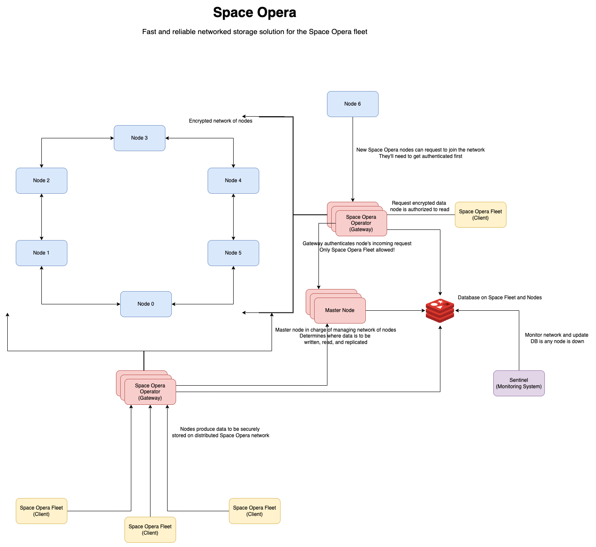
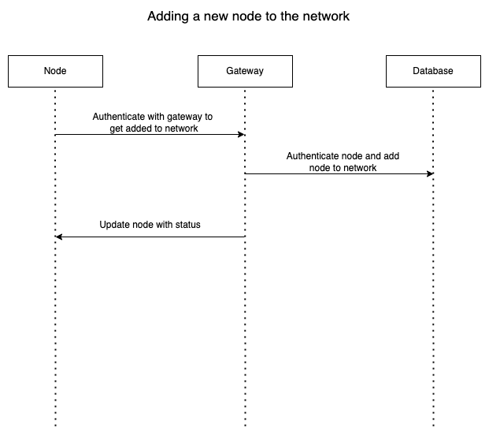
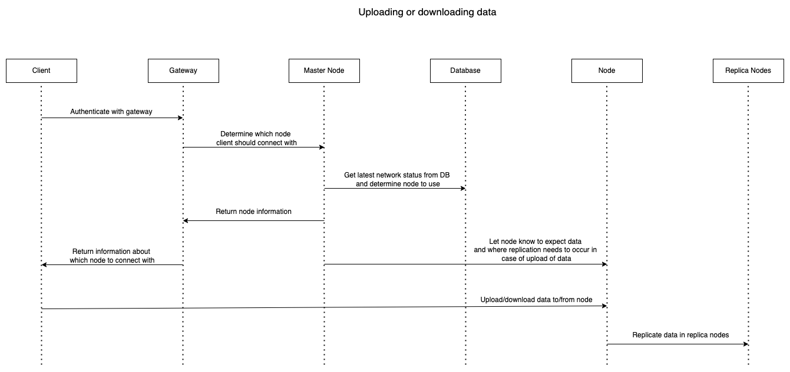
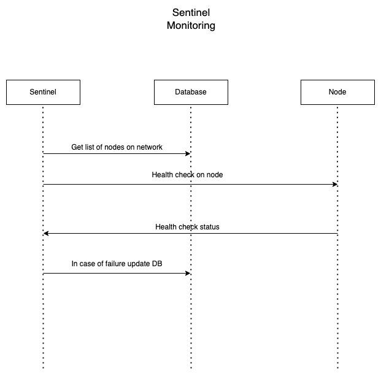

# Space Opera

A Fast and Reliable Distributed Data Sharing System

## Space Opera Distributed Data Share System

The distributed data sharing system is a collection of nodes (members of Space Opera) that comprise of a private network. This private network of Space Opera nodes can be used to share data between nodes and also store data on the network itself.

Storing data on the network consists of the nodes on the network storing this data. Therefore, this network will have to deal with challenges pertaining to data consistency, fault tolerance, and data replication.

Requests can be made by a node on the network to read or write any specific data. Data in this case can be considered to be high volume information about different star systems (data that can be indexed for high performance). All the data on the network will also be encrypted so that only trusted Space Opera nodes can decrypt and use this data. Similarly, only authenticated Space Opera nodes can join the network.

A simple UI/CLI interface can be built to showcase a node on the network interacting with the network to read/write data.

Some key areas that this project will focus on:

- Persistance of data on the node, either in memory or in storage
- Sharding of data, potentially using techniques such as consistent hashing, rendezvous hashing, etc.
- Indexing all this data for high performance
- Providing fault tolerance on the network by allowing nodes to join and leave as needed
  - This also deals with data replication
- Efficient encryption of data
- Node validation
- Network management
- A lot of other points can be added here depending on what different teams are interested in as the above only covers the basic things required to make this network operational

### Architecture Diagram

- `.drawio` file for the diagram above is available at [space-opera-design.drawio](./diagrams/space-opera-design.drawio)

### Flow Diagrams

- Adding a new node to the network

- Uploading and downloading data from the network

- Moniroting the network

### Overview of Components

#### Node
- Node registers onto the network by initially communicating with the gateway
  - Node gets authenticated by the gateway and receives the IP address of the master node
- Node accepts upload and download requests from the client
- Node informs the master node when data is uploaded to it
  - Node receives IP addresses of other nodes where data needs to be replicated -> node replicates data based on this
- Node must be able to receive a message from the master node about replicating data when some other node fails
  - Node will recieve IP addresses of other nodes where data needs to be replicated -> node replicates data based on this

#### Master Node
- Master node receives message from gateway about new node joining the network
- Master node receives message from gateway whenever a client wants to download/upload data
  - Master node determines which node to send the request to and returns appropriate IP address to the gateway which is then returnd to the client
  - Master node writes data to the database about file saved in node
- Master node receives message from sentinel monitoring system anytime a node goes down
  - Master node will determine which remaining nodes to replicate data on and send message to appropriate nodes to carry out replication
- Master node receives message from node once upload of data is complete to that node from client
  - Master node responds with list of nodes in which current node should replicate data
- Master node can return list of all data on network - required for CLI
- Since master node needs replication and availability, we decided to explore using a Kubernetes cluster containing pods of the master node. We should be able to keep a single IP address this way and have Kubernetes manage uptime of the master node.

#### Gateway
- Gateway authenticates and registers node for the first time onto the network
  - Gateway returns IP address of master node to node after authentication
- Gateway writes information about new node joining the network to database
- Gateway informs master node about new node joining the network
- Gateway authenticates client requests to upload/download data and returns appropriate IP address to the client after checking with master node

#### Monitoring System (Sentinel)
- Sentinel constantly health checks the nodes in the network to check upkeep
- Sentinel informs the master node whenever a node goes down
- Sentinel updates database with information about node going down
- *Other monitoring and health check features can be added if required*

#### CLI/Client
- CLI/Client can upload/download data from nodes on the network
  - CLI/Client authenticates with teh gateway when it wants to upload/download data
  - CLI/Client receives node address to connect to and then directly uploads/downloads data from that node
- CLI can be used to view all the files currently on the network

#### Database
- Database stores information about nodes on the network
- Database could be a simple instance of Redis

### Assignment of Components

- Node
  - Tuba Ahmed, Abul Hasan Mohammed, Abhishek, Roopesh (Java)
  - Rohit, Rushikesh, Rahil, Yi, Vineet
  - Tzu-Chuan Lin, Yu-Che Lin, Mu-Te Shen, Jinfan Zhang
- Master Node
  - Mayank Garg, Mayank Verma, Pratyush Sharma
  - Anupriya, Arpitha, Rounak, Sandhya
- Sentinel (Monitoring System)
  - Shradha, Brinda, Jui, Saurabh
  - AJ, Aniket, Aomkar, Sandesh, Jayanth
- Gateway
  - Dhrupa Patel, Sai Kiran, Dhruvi, Sai Krishna, Hrishikesh
  - Rohit, Adarsh, Yash, Shivang
- CLI/Client
  - Rohit, Adarsh, Yash, Shivang
- Database
  - Teams who will be working with the database can collaborate and come up with a common schema that is used
  - For testing purposes a simple Redis instance can be used for each individual team until we integrate all our work