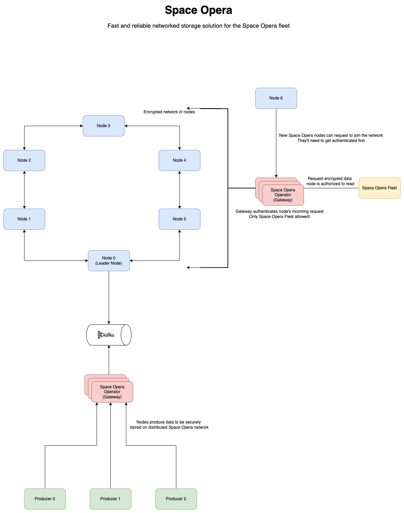

# Space Opera Distributed Data Share System

The distributed data sharing system is a collection of nodes (members of Space Opera) that comprise of a private network. This private network of Space Opera nodes can be used to share data between nodes and also store data on the network itself.

Storing data on the network consists of the nodes on the network storing this data. Therefore, this network will have to deal with challenges pertaining to data consistency, fault tolerance, and data replication.

Requests can be made by a node on the network to read or write any specific data. Data in this case can be considered to be high volume information about different star systems (data that can be indexed for high performance). All the data on the network will also be encrypted so that only trusted Space Opera nodes can decrypt and use this data. Similarly, only authenticated Space Opera nodes can join the network.

A simple UI/CLI interface can be built to showcase a node on the network interacting with the network to read/write data.

Some key areas that this project will focus on:

- Persistance of data on the node, either in memory or in storage
- Sharding of data, potentially using techniques such as consistent hashing, rendezvous hashing, etc.
- Indexing all this data for high performance
- Providing fault tolerance on the network by allowing nodes to join and leave as needed
  - This also deals with data replication
- Efficient encryption of data
- Node validation
- Network management
- A lot of other points can be added here depending on what different teams are interested in as the above only covers the basic things required to make this network operational

## Architecture Diagram

- `.drawio` file for the diagram above is available at [space-opera-design.drawio](./diagrams/space-opera-design.drawio)
